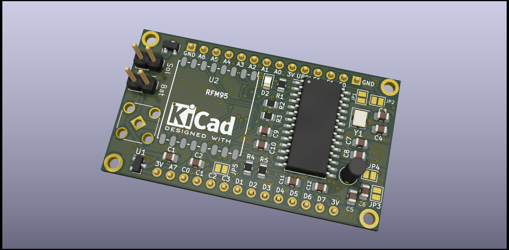

# AVR128DB28
AVR Printed Circuit Board for creating IOT nodes with the RFM95 LORA chip.

See:
- https://www.thethingsnetwork.org/forum/t/avr128db28-pcb-with-rfm95/50864
- https://www.thethingsnetwork.org/labs/story/a-cheap-stm32-arduino-node

for background and software samples.

Schema: https://github.com/tomtor/STM32-RFM95-PCB/raw/master/AVR-LORA.pdf

Note that most components are optional:

- A LED to flash
- I2C 4K7 pull up resistors
- A lot of capacitors (mounting a single 1uF will do in most situations)
- 32.768kHz crystal
- 24MHz crystal
- MCP1700 regulator with 1uA idle current
- Schottky diode for charging NiMH batteries from a solar panel
- Voltage divider for measuring battery voltage

Aisler link for producing 1206 board: https://aisler.net/p/EAZHDDHF

Aisler link for producing 0805 board: https://aisler.net/p/ZRKAROVP

# STM32-RFM95-PCB
STM32 Printed Circuit Board for creating IOT nodes with the RFM95 LORA chip

See: https://www.thethingsnetwork.org/labs/story/a-cheap-stm32-arduino-node

You can order this board here:

https://aisler.net/p/CZGCIFFH

Credits:

https://github.com/myelin/myelin-kicad-libraries (STM32 module KiCad library)

https://github.com/mysensors-kicad/mysensors_symbols (RFM95 KiCad library)

https://github.com/novirium/ESPilot/blob/master/lib/ESPilot.pretty/RFM95.kicad_mod (RFM95 KiCad footprint)
